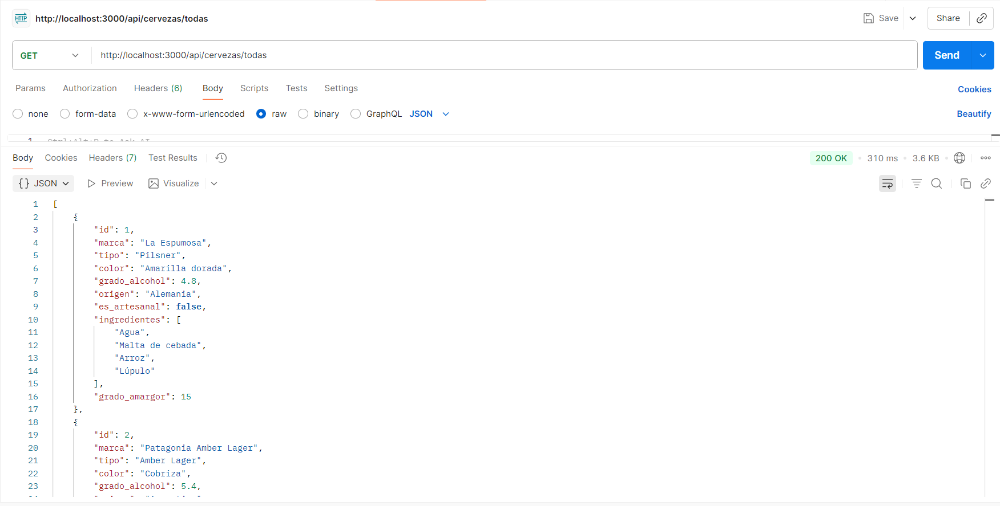
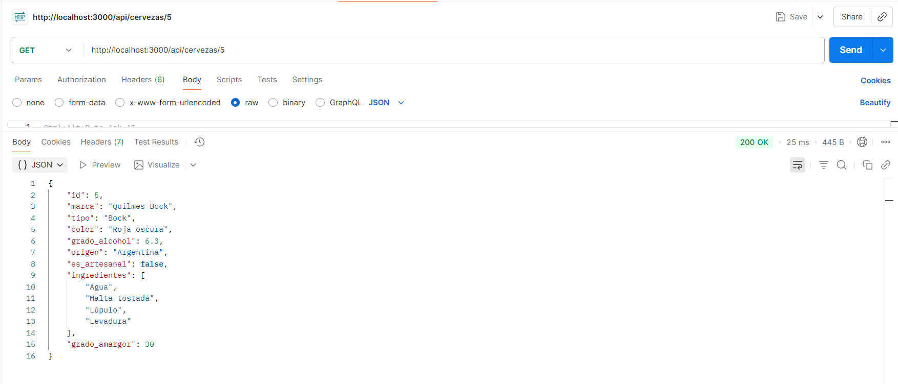
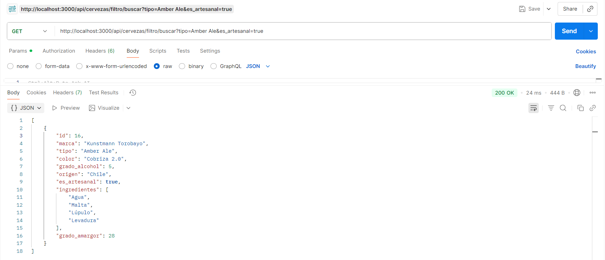
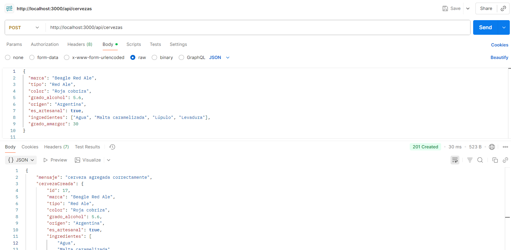
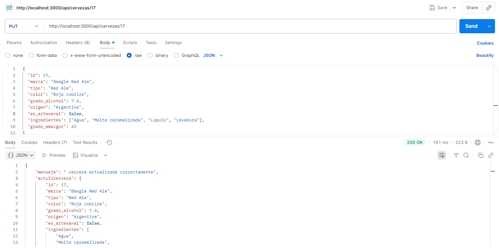
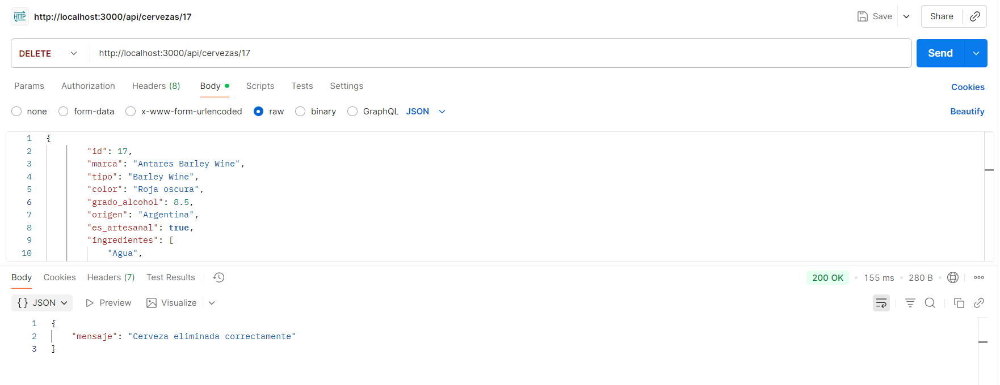

# 🍺 API de Cervezas Artesanales y Comerciales

## 1. Descripción general

**Tema elegido y motivo de elección**  
Se optó por una API REST de **cervezas** por ser un producto culturalmente rico, con múltiples atributos técnicos (color, amargor, origen, ingredientes, etc.) que permiten ejemplificar filtros, validaciones y CRUD sin necesidad de autenticación ni lógica de negocio compleja.

**Breve resumen del funcionamiento**  
La API permite listar, buscar, filtrar, crear, actualizar y eliminar registros de cervezas almacenados en un archivo JSON plano.  
Implementa **arquitectura MVC** y **middlewares propios** (logger y validación) para separar responsabilidades y mantener el código limpio.

---

## 2. Arquitectura MVC + JS Vanilla + JSON (explicación punto por punto)
Vistas (Capa de Ruteo)
Están escritas con Express Router y JS puro. Su única responsabilidad es recibir la petición HTTP, identificar el verbo y la ruta, y despacharla hacia la función correspondiente del controlador. No contienen lógica de negocio ni acceden al JSON.
Archivo concreto: vistas/cervezasVistas.js.
Controlador (Capa de Orquestación)
También en JS vanilla. Recibe req y res desde la vista, extrae parámetros, query strings o body, y llama al modelo. Cuando el modelo devuelve datos, el controlador decide el código de estado HTTP (200, 201, 404, 400, 500) y la respuesta JSON final.
Archivo concreto: controladores/cervezasControlador.js.
Modelo (Capa de Acceso a Datos)
Puro JavaScript sin dependencias extra. Lee y escribe de forma síncrona el archivo data/cervezas.json con fs.readFileSync y writeFileSync. Implementa las operaciones CRUD básicas, genera el siguiente ID disponible y ejecuta los filtros por campos dinámicos.
Archivo concreto: modelos/cervezasModelos.js.
Middlewares (Funciones Intermedias)
Son funciones vanilla que Express ejecuta antes que la ruta final.
logger.js: se engancha globalmente con app.use(logger); imprime método, ruta y hora en consola para cada request.
validateCerveza.js: se aplica solo a PUT /api/cervezas/:id; revisa tipos, campos obligatorios y existencia del ID, cortando la cadena con 400 si algo falla.
Base de Datos (Archivo Plano)
Un único fichero JSON (data/cervezas.json) que actúa como persistencia. Se sobrescribe completamente tras cada alta, baja o modificación. No hay motor ni ORM: solo JSON.parse y JSON.stringify.

---

## 3. Endpoints documentados

| Método | Ruta | Descripción | Ejemplo de uso |
|--------|------|-------------|----------------|
| GET | `/api/cervezas/todas` | Obtener **todas** las cervezas | `/api/cervezas/todas` |
| GET | `/api/cervezas/:id` | Obtener **una** cerveza por ID | `/api/cervezas/3` |
| GET | `/api/cervezas/filtro/buscar?clave=valor` | Filtrar por **cualquier campo** (marca, tipo, origen, es_artesanal, etc.) | `/api/cervezas/filtro/buscar?tipo=IPA&origen=Argentina` |
| POST | `/api/cervezas` | **Crear** nueva cerveza (el ID se genera automáticamente) | Ver JSON abajo |
| PUT | `/api/cervezas/:id` | **Actualizar** cerveza existente (todos los campos obligatorios) | `/api/cervezas/17` |
| DELETE | `/api/cervezas/:id` | **Eliminar** cerveza | `/api/cervezas/17` |

**Ejemplo POST body (201 Created)**
```json
{
  "marca": "Honey Moon",
  "tipo": "Honey Ale",
  "color": "Dorada",
  "grado_alcohol": 5.0,
  "origen": "Chile",
  "es_artesanal": true,
  "ingredientes": ["Agua", "Malta", "Miel", "Lúpulo"],
  "grado_amargor": 20
}
```
--------
### Crear una cerveza (POST /api/cervezas)

El cuerpo de la petición **puede omitir** cualquier campo; la API completará los faltantes con valores por defecto y devolverá la lista de campos que fueron rellenados.

**Ejemplo mínimo**
```http
POST /api/cervezas
Content-Type: application/json
```json
{
  "marca": "Mi IPA"
}
```
**Respuesta 201**

```json
{
  "mensaje": "Cerveza creada correctamente",
  "cerveza": {
    "id": 18,
    "marca": "Mi IPA",
    "tipo": "Lager",
    "color": "Rubia",
    "grado_alcohol": 4.5,
    "origen": "Desconocido",
    "es_artesanal": false,
    "ingredientes": ["Agua", "Malta", "Lúpulo"],
    "grado_amargor": 15
  },
  "camposCompletados": ["tipo", "color", "grado_alcohol", "origen", "es_artesanal", "ingredientes", "grado_amargor"]
}
```


Con ese pequeño bloque queda documentado el **nuevo comportamiento** y tus usuarios (o tu yo del futuro) saben que pueden enviar solo lo que conocen.

Validaciones  
- Solo se verifica **el tipo de dato** cuando el campo es enviado.  
- Ejemplo de error: enviar `"grado_alcohol": "cinco"` devuelve  
  `400 { "error": "El campo 'grado_alcohol' debe ser un numero positivo" }`.  
- **No se exige** ningún campo como obligatorio en el body.

----

## 4. Middlewares implementados

|Middleware	 |Momento de ejecución	|Función   |
|------------|----------------------|----------|
|logger	  |Siempre, antes que cualquier ruta.|	Imprime en consola: [MÉTODO] /ruta - hh:mm:ss |
validateCerveza	|Solo en PUT (/api/cervezas/:id).|	Verifica que el ID exista, que vengan todos los campos obligatorios y que sus tipos sean correctos. De lo contrario responde 400 con mensaje descriptivo.|

---

## 5. Validaciones
Campos obligatorios (todos)
id,
marca,
tipo,
color,
grado_alcohol,
origen, es_artesanal,
ingredientes,
grado_amargor

**Reglas**

|Campo	|Regla	|Mensaje de error|
|-------|-------|----------------|
|id	|En PUT debe existir; en POST no debe enviarse	|“No envíes el ‘id’ al crear una cerveza.”|
|marca,tipo,color,origen	|string	|“… deben ser texto”|
|grado_alcohol	|number ≥ 0	|“… debe ser un numero positivo”|
|es_artesanal	|boolean	|“… debe ser true o false”|
|ingredientes	|array	|“… debe ser un array (lista)”|
|grado_amargor	|number	|“… debe ser un numero”|

**Ejemplo de error 400**

```json
{
  "error": "El campo 'grado_alcohol' debe ser un numero positivo"
}
```
----

## 6. Ejemplos de uso (Postman)

## prueba de get (todas, por id, filtro)













---
## 7. Conclusión

**Dificultades**
Manejar la validación de tipos y la existencia del ID en la misma función sin repetir lógica.
Decidir si el ID autoincremental se genera en modelo o controlador; finalmente quedó en modelo para no exponer lógica al exterior.
**Aprendizajes**
Separar responsabilidades hace que agregar nuevas reglas (p.e. validar rangos de amargor) sea trivial.
Un logger simple ahorra horas al rastrear errores en desarrollo.
Trabajar con un archivo plano es suficiente para una API académica, pero evidencia la necesidad de una base de datos real cuando la concurrencia aumenta.